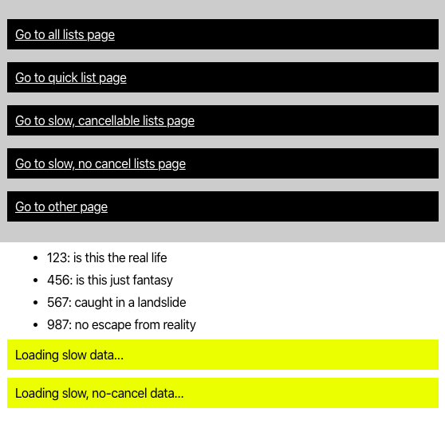

# Hooks and cancel

React hooks and cancelling in-flight requests when unmounting components

## Pre-requisites

This was built using node 12.7.0 and yarn 1.21.1

Install all the dependencies using

```bash
$ yarn install
```

## Running

This demo runs a (hapi)[https://hapi.dev/] based server to serve Ajax requests, and a dev server to display the site, you'll need to run both. This will require two console windows. In the first, start the hapi server.

```bash
$ yarn server
```

and then you can start the demo using

```bash
$ yarn start
```

## What is it all about?

The demo is code supporting an article []() that discusses some common issues with hooks and axios (or other) rest clients namely loading state and handling unmounted components.

## REST clients

There are a few pain points with managing REST requests in your UI - loading states, error states, and in React, handling what happens when you unmount the component _before_ the request response is received. A decent REST client should implement a promise based API so handling errors _should_ be straightforward, but this is complicated when components are unmounted.

### Handling unmounted components

Usually a boolean property named `isMounted` is used to track whether the component is mounted. This property needs to be updated whenever the component is mounted or unmounted and must be checked before state or anything with a side-effect is executed.

### Cancelling requests

[Axios](https://github.com/axios/axios) and other REST client allow you to cancel in-flight requests, meaning the promise will not be fulfilled. Ideally any in-flight requests should be cancelled when a component is unmounted.

### Enhanced client

The suggested 'enhanced client' presented in the demo incorporates the loading state and offers a simple API to facilitate cancelling requests.

## The demo



When you run the demo you will see a list of navigation links and a list of items generated from the 'quick' load, and two loading states indicating that the slow loads are in-flight.

You should open the developer tools in your browser to see the problem with non-cancellable requests.

### Non-cancelled requests and unmounting

If you click on the `Go to other page` link before the slow loading requests complete and watch the console you will see the issue when the non-cancellable requests returns.

```
index.js:1 Warning: Can't perform a React state update on an unmounted component. This is a no-op, but it indicates a memory leak in your application. To fix, cancel all subscriptions and asynchronous tasks in a useEffect cleanup function.
    in App (at App.js:21)
```

Unless we track the mounted state of the component with something like an `isMounted` property - which adds a lot of overhead and unwanted complexity - we will see this issue.

### Cancelled request

The cancelled request does not try and update the state of the unmounted component.